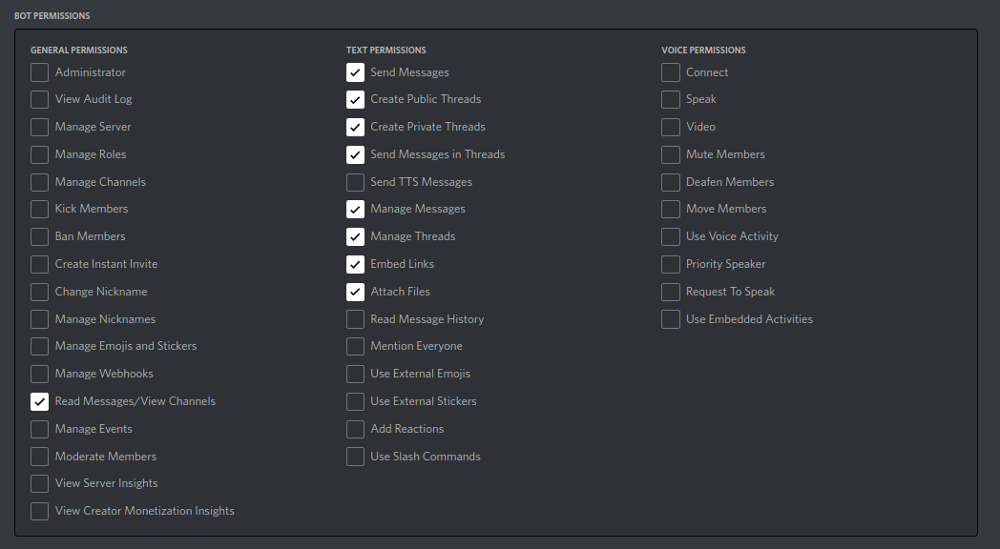

# Sevenβ Discord Bot
A discord bot for 7Span's server. The [ClickUp API](https://clickup.com/api/) and [Discord.py](https://github.com/Rapptz/discord.py) were used to develop this bot. It has the following features
- Employees can get details of every day ClickUp task hours.
- Gives monthly summary of ClickUp hours.
- Birthday and work anniversary greetings in the celebration channel.
- Notifies Harsh Kansagra of newly joined users in 7Span server.
- Send every day report of employees' logged hours to HR in XML file format
- Creates morning and evening threads for the EOD report in the specified Discord channels.
- A broadcast command that sends a message via DM to every user.
- Sends random memes of a given category
- Sends random facts about the world
- Offers a help manual


## Installation
### Create discord application in developer portal
1. Open the [Discord developer portal](https://discord.com/developers/applications) and log into your account.
2. Select "New Application" from the menu.
3. Type a name into the pop-up window and click "Create" to confirm.
4. Use the left-side menubar to access the Bot menu.
5. Add a single bot, configure the access token, and then keep it somewhere for future usage.
6. In the menu on the left, select OAuth2 > URL Generator.
7. Choose Bot in the scopes area and check the below boxes in the permissions options.

8. Next, paste the generated URL into your browser and invite your bot to your server.

### Now you have to setup project
1. Install Python3.x in your machine
2. Clone this repository in your workspace
```shell
git clone https://github.com/parth-p-7span/discord-bot-python.git
```
3. Navigate to discord-bot-python folder in your terminal/CMD
```shell
cd discord-bot-python
```
4. Install required packages for the project using below command
```shell
pip install -r requirements.txt
```
5. Create a file in project root directory named with `.env` and add your credentials in that file. [Click here](https://gist.githubusercontent.com/parth-p-7span/147a289ae4111f77f816b2fcebf30ce5/raw/7a5a5bdc753b92c6f81b7cfe33aeacd245c482ab/temp.env) for example file.
6. Run the `main.py` file using following command.
```shell
python main.py
```
